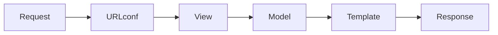
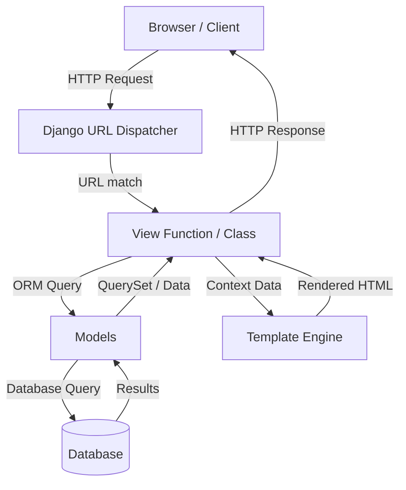
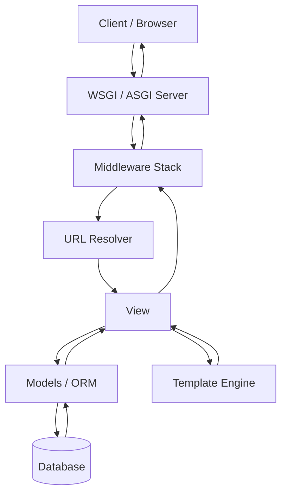
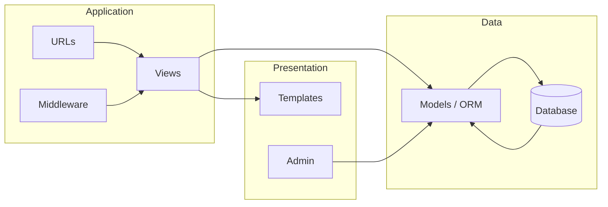

# Intro to Django Framework

## Key Design Principles

- Django is a free and open-source, Python-based web framework that runs on a web server.

- It follows the `Model–Template–View (MTV)` architectural pattern.

- Django comes with a built-in authentication system, ORM, admin interface, and many common web features out of the box.

- Batteries included: Django provides most features required to build web applications without third-party packages.

- DRY (Don’t Repeat Yourself): Encourages reusable components, class based views and centralized logic.

- Explicit is better than implicit: Configuration and behavior are intentionally clear.

- Security by default: Many common web vulnerabilities are handled automatically.

- The ORM (Object–Relational Mapping) translates Python code into SQL queries and executes them on the database.

## Components:

??? "Models"

    - Define the data schema using Python classes

    - Managed via Django’s ORM

    - Automatically generate database tables via migrations

??? "Views"

    - Contain the business logic

    - Handle HTTP requests and return HTTP responses

    - Can be function-based or class-based

??? "Templates"

    - Define the presentation layer

    - Use Django Template Language (DTL)

    - Designed to keep logic minimal and readable

??? "URL Dispatcher"

    - Maps URLs to views

    - Uses readable and declarative URL patterns

    - Decouples URL structure from view logic

??? "Manager"

    - Serve as the **entry point** for database operations on a model.

    - Provide the default interface: `Model.objects.all()`, `.filter()`, `.create()`, etc.

    - Can be customized to add domain-specific query methods or default querysets.

    - Allow clean separation of common/reusable query patterns from business logic.

??? "Filters or Queries"

    - Build dynamic database lookups using Django’s expressive **QuerySet API**.

    - Chainable methods: `.filter()`, `.exclude()`, `.order_by()`, `.annotate()`, `.values()`, etc. 

    - Supports lookups (`__exact`, `__contains`, `__gte`, `__in`, `__startswith`, etc.) and Q objects for complex conditions.

    - The heart of almost every data retrieval operation in Django.

??? "Forms"

    - Handle **user input validation**, cleaning & conversion to Python values.

    - Can be bound to models (`ModelForm`) or be completely standalone (`Form`).

    - Provide rendering helpers + error messages + initial values.

    - Separate input handling logic from views and templates.

??? "Services"

    - Contain **complex business logic** that doesn’t naturally belong in models, views or forms.

    - Usually written as plain Python classes or functions (not tied to HTTP or ORM directly).

    - Promote single-responsibility & testability (fat models / thin views → services in between).

    - Common examples: payment processing, email sending, report generation, domain rules enforcement.

## How Django Handles a Request

1. Browser sends HTTP request
2. URL dispatcher selects a view
3. View executes business logic
4. ORM talks to the database
5. Template renders HTML
6. Django returns HTTP response

#### - Django Concept Graph:

#### - Django request/response lifecycle:

#### - Django request/response lifecycle including Middleware:

#### - Django Architecture Overview:

