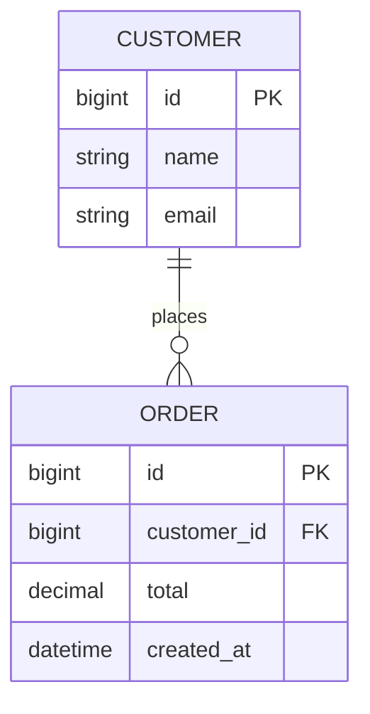
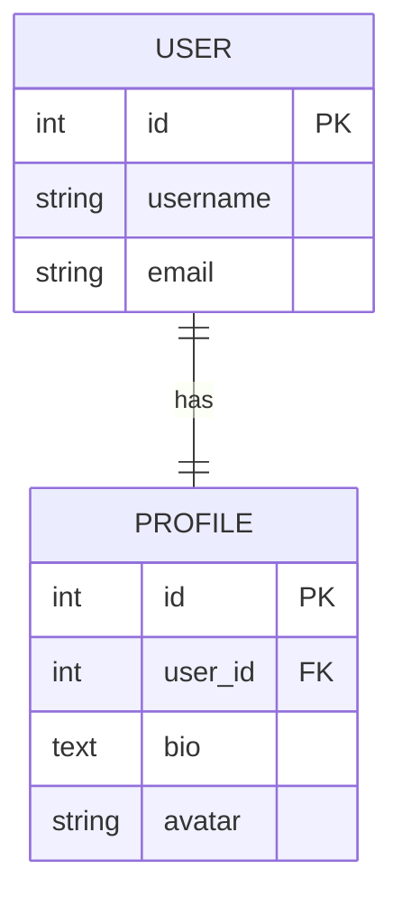
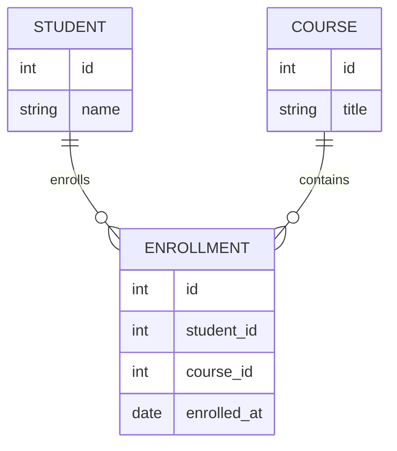
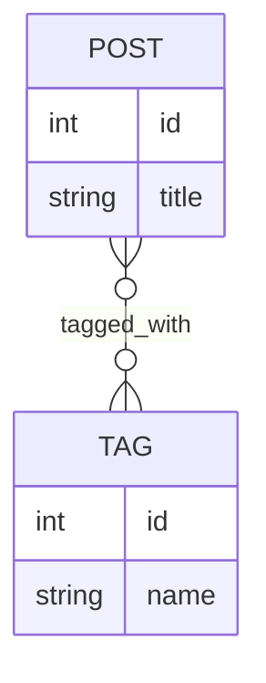

# `models.py` notes

## Models

!!! note "Convention" 
    
    Convention: One models.py per app (can be split into a package for large apps).

    ```bash
        models/
            ├── __init__.py
            ├── product.py
            ├── category.py
    ```
    ```bash
    # models/__init__.py
        from .product import Product
        from .category import Category

    ```

- Field Options (Common to Most Fields):

| Option         | Description                |
| -------------- | -------------------------- |
| `null`         | Store NULL in DB           |
| `blank`        | Allow empty value in forms |
| `default`      | Default value              |
| `unique`       | Enforce uniqueness         |
| `db_index`     | Add DB index               |
| `editable`     | Editable in admin          |
| `help_text`    | Admin form help            |
| `verbose_name` | Human-readable name        |
| `choices`      | Limited set of values      |

!!! warning "Important Notes"

    null → database-level

    blank → form-level

    default=NOT_PROVIDED means required

    db_index=True adds a DB index

    unique=True creates a uniqueness constraint


!!! tip "Mental Checklist"

    Before committing a model change, ask:

    Will this break existing data?

    Does this need an index?

    Should this be nullable?

    Does this need related_name?

    Does this belong in a model or service?

    Is this safe to migrate in production?

---

### Field types

Django model fields are defined using `models.FieldType()`.

| Field Type | Example | Purpose |
|---|---|---|
| `AutoField` | `models.AutoField()` | Auto-incrementing integer primary key |
| `BigAutoField` | `models.BigAutoField()` | Auto-incrementing large integer primary key |
| `SmallAutoField` | `models.SmallAutoField()` | Auto-incrementing small integer primary key |
| `BigIntegerField` | `models.BigIntegerField()` | Large signed integer |
| `BinaryField` | `models.BinaryField()` | Store raw binary data |
| `BooleanField` | `models.BooleanField()` | Store `True` / `False` |
| `CharField` | `models.CharField(max_length=255)` | Short text/string |
| `DateField` | `models.DateField()` | Date without time |
| `DateTimeField` | `models.DateTimeField()` | Date and time |
| `DecimalField` | `models.DecimalField(max_digits=10, decimal_places=2)` | Fixed-precision decimal numbers |
| `DurationField` | `models.DurationField()` | Store a duration/time interval |
| `EmailField` | `models.EmailField()` | Email address |
| `FileField` | `models.FileField(upload_to="files/")` | Uploaded files |
| `FilePathField` | `models.FilePathField(path="/files/")` | File paths from a filesystem directory |
| `FloatField` | `models.FloatField()` | Floating-point number |
| `GenericIPAddressField` | `models.GenericIPAddressField()` | IPv4 or IPv6 address |
| `ImageField` | `models.ImageField(upload_to="images/")` | Uploaded image files |
| `IntegerField` | `models.IntegerField()` | Standard signed integer |
| `JSONField` | `models.JSONField()` | Store JSON objects/arrays |
| `PositiveBigIntegerField` | `models.PositiveBigIntegerField()` | Large non-negative integer |
| `PositiveIntegerField` | `models.PositiveIntegerField()` | Non-negative integer |
| `PositiveSmallIntegerField` | `models.PositiveSmallIntegerField()` | Small non-negative integer |
| `SlugField` | `models.SlugField(max_length=255)` | URL-friendly text/slug |
| `SmallIntegerField` | `models.SmallIntegerField()` | Small signed integer |
| `TextField` | `models.TextField()` | Large/unlimited text |
| `TimeField` | `models.TimeField()` | Time without a date |
| `UUIDField` | `models.UUIDField()` | Universally unique identifier |


!!! tip "DateTime Fields"

    ```bash
    auto_now_add=True → on creation
    ```
    ```bash
    auto_now=True → on every save
    ```

!!! abstract "File & Media Fields"

    Requires `Pillow` package for ImageField.


!!! note "Integer Differences"

    Best Practices:

        Use `PositiveSmallIntegerField` for enums and choices.

        Use `PositiveIntegerField` for counts and totals.

        Use `SmallIntegerField` when negatives are meaningful.

        Prefer `IntegerField` unless size constraints matter.

    These fields differ mainly in storage size and allowed range, not behavior.

    | Field                       | Allowed Range (DB-dependent) | Use Case             |
    | --------------------------- | ---------------------------- | -------------------- |
    | `SmallIntegerField`         | ~ -32,768 to 32,767          | Status codes, enums  |
    | `PositiveIntegerField`      | ≥ 0                          | Counters, quantities |
    | `PositiveSmallIntegerField` | ≥ 0 (small range)            | Flags, rankings      |

!!! info "Models & Migrations - Create Models and apply migrations"

    1. python manage.py makemigrations app_name
    2. Inspect the migration file.
    3. python manage.py migrate app_name --plan
    4. python manage.py migrate app_name => app scope migration
    5. python manage.py migrate => project scope migration
    6. python manage.py showmigrations app_name

---

### Relationship Fields

| Field Type | Example | Purpose |
|---|---|---|
| `ForeignKey` | `models.ForeignKey(User, on_delete=models.CASCADE)` | Many-to-one relationship |
| `OneToOneField` | `models.OneToOneField(User, on_delete=models.CASCADE)` | One-to-one relationship |
| `ManyToManyField` | `models.ManyToManyField(Product)` | Many-to-many relationship |

#### Foreign Key

- `models.ForeignKey()` (One to Many)

```python
models.ForeignKey(
    to,
    on_delete,
    related_name=None,
    related_query_name=None,
    limit_choices_to=None,
    null=False,
    blank=False,
    db_index=True,
    editable=True,
    help_text="",
    verbose_name=None
)
```
- Code example:

```python
from django.db import models


class Customer(models.Model):
    id = models.BigAutoField(primary_key=True)
    name = models.CharField(max_length=100)
    email = models.EmailField(unique=True)


class Order(models.Model):
    id = models.BigAutoField(primary_key=True)
    customer = models.ForeignKey(
        Customer,
        on_delete=models.CASCADE,
        related_name="orders",
    )
    total = models.DecimalField(max_digits=10, decimal_places=2)
    created_at = models.DateTimeField(auto_now_add=True)
```

- Diagram:



---

#### OneToOneField

- `models.OneToOneField()`

```python
models.OneToOneField(
    to,
    on_delete,
    parent_link=False,
    related_name=None,
    null=False,
    blank=False,
    editable=True,
    help_text="",
    verbose_name=None
)
```

- One To One (ONE object instance is taking up ONE object attributes) code example:

```python
from django.db import models


class User(models.Model):
    username = models.CharField(max_length=150)
    email = models.EmailField(unique=True)

    def __str__(self):
        return self.username


class Profile(models.Model):
    user = models.OneToOneField(
        User,
        on_delete=models.CASCADE,
        related_name="profile",
    )
    bio = models.TextField(blank=True)
    avatar = models.ImageField(
        upload_to="avatars/",
        blank=True,
    )

    def __str__(self):
        return f"{self.user.username}'s Profile"
```

- Diagram:



---

#### ManyToManyField

- ManyToManyField()

```python
models.ManyToManyField(
    to,
    related_name=None,
    related_query_name=None,
    blank=False,
    through=None,
    through_fields=None,
    symmetrical=True,
    editable=True,
    help_text="",
    verbose_name=None
)
```

- Example 1:

Code:

```python
class Enrollment(models.Model):
    student = models.ForeignKey("Student", on_delete=models.CASCADE)
    course = models.ForeignKey("Course", on_delete=models.CASCADE)
    enrolled_at = models.DateField()

class Student(models.Model):
    courses = models.ManyToManyField(
        "Course",
        through="Enrollment"
    )

class Course(models.Model):
    name = models.CharField(max_length=200)
    price = models.DecimalField(
        max_digits=10,
        decimal_places=2,
    )
```

Diagram:



- Accessing Related Data

```python
enrollment.student
enrollment.student.full_name

enrollment.course
enrollment.course.name
enrollment.course.price

enrollment.enrolled_at
```

- Example 2:

```python
class Tag(models.Model):
    name = models.CharField(max_length=50)

class Post(models.Model):
    title = models.CharField(max_length=200)
    tags = models.ManyToManyField(
        Tag,
        related_name="posts"
    )
```

- Diagram 2:



---

### Meta class

```python
class MyModel(models.Model):
    ...

    class Meta:
        ...
```

| Meta Attribute          | Example                                                                        | Purpose                                                                          |
| ----------------------- | ------------------------------------------------------------------------------ | -------------------------------------------------------------------------------- |
| `abstract`              | `abstract = True`                                                              | Makes the model an abstract base model; no database table is created             |
| `app_label`             | `app_label = "products"`                                                       | Specifies which Django app the model belongs to                                  |
| `base_manager_name`     | `base_manager_name = "all_objects"`                                            | Specifies the name of the model's base manager                                   |
| `db_table`              | `db_table = "products"`                                                        | Specifies the database table name                                                |
| `db_table_comment`      | `db_table_comment = "Stores product information"`                              | Adds a comment to the database table                                             |
| `db_tablespace`         | `db_tablespace = "products_space"`                                             | Specifies the database tablespace                                                |
| `default_manager_name`  | `default_manager_name = "objects"`                                             | Specifies the model's default manager                                            |
| `default_related_name`  | `default_related_name = "products"`                                            | Sets the default reverse relation name                                           |
| `get_latest_by`         | `get_latest_by = "created_at"`                                                 | Specifies the field used by `latest()` and `earliest()`                          |
| `managed`               | `managed = False`                                                              | Prevents Django from creating, modifying, or deleting the database table         |
| `order_with_respect_to` | `order_with_respect_to = "category"`                                           | Adds ordering support relative to a related object                               |
| `ordering`              | `ordering = ["-created_at"]`                                                   | Sets the default ordering for QuerySets                                          |
| `permissions`           | `permissions = [("can_export", "Can export products")]`                        | Defines custom model permissions                                                 |
| `default_permissions`   | `default_permissions = ("add", "change", "delete", "view")`                    | Controls which default permissions Django creates                                |
| `proxy`                 | `proxy = True`                                                                 | Creates a proxy model without creating a new database table                      |
| `required_db_features`  | `required_db_features = ["gis_enabled"]`                                       | Restricts model creation to databases supporting specified features              |
| `required_db_vendor`    | `required_db_vendor = "postgresql"`                                            | Restricts model creation to a specific database vendor                           |
| `select_on_save`        | `select_on_save = True`                                                        | Uses Django's older SELECT-before-UPDATE behavior when saving                    |
| `indexes`               | `indexes = [models.Index(fields=["name"])]`                                    | Defines database indexes                                                         |
| `constraints`           | `constraints = [models.UniqueConstraint(fields=["code"], name="unique_code")]` | Defines database constraints                                                     |
| `unique_together`       | `unique_together = [["first_name", "last_name"]]`                              | Enforces uniqueness across multiple fields; legacy API                           |
| `index_together`        | `index_together = [["category", "created_at"]]`                                | Creates indexes across multiple fields; legacy API                               |
| `verbose_name`          | `verbose_name = "Product"`                                                     | Human-readable singular model name                                               |
| `verbose_name_plural`   | `verbose_name_plural = "Products"`                                             | Human-readable plural model name                                                 |
| `label`                 | `label = "products.Product"`                                                   | Model label; generally read-only/generated, not normally set in `Meta`           |
| `label_lower`           | `label_lower = "products.product"`                                             | Lowercase model label; generally read-only/generated, not normally set in `Meta` |

!!! Danger "Important"

    `unique_together` and `index_together` are **legacy** options. For new projects, prefer constraints with UniqueConstraint and indexes with Index.

    Also, label and label_lower are model metadata properties, not attributes you normally define yourself in Meta.

- Example:

```python
class Product(models.Model):
    name = models.CharField(max_length=200)
    category = models.ForeignKey(Category, on_delete=models.CASCADE)
    created_at = models.DateTimeField(auto_now_add=True)

    class Meta:
        ordering = ["-created_at"]
        indexes = [
            models.Index(fields=["name"]),
        ]
        constraints = [
            models.UniqueConstraint(
                fields=["name", "category"],
                name="unique_product_category",
            ),
        ]
        verbose_name = "Product"
        verbose_name_plural = "Products"
```

---

### Constraints

Forms/serializers give the user a nice validation error.

The database constraint guarantees the rule cannot be violated.

| Question  | Summary                                                                                                                           |
| --------- | --------------------------------------------------------------------------------------------------------------------------------- |
| **What?** | A **database rule** that defines what data is allowed to be stored.                                                               |
| **Why?**  | To **guarantee data integrity** and prevent invalid or conflicting data from entering the database.                               |
| **How?**  | Define it in `Meta.constraints`, then run `makemigrations` and `migrate`. Django creates the corresponding database constraint.   |
| **When?** | Use it when a rule must **always be true**, regardless of whether data comes from a form, API, admin, script, or background task. |

---

#### `UniqueConstraint`

Ensures a value or combination of values is unique.

```python
class Product(models.Model):
    name = models.CharField(max_length=200)
    category = models.ForeignKey(Category, on_delete=models.CASCADE)

    class Meta:
        constraints = [
            models.UniqueConstraint(
                fields=["name", "category"],
                name="unique_product_per_category",
            ),
        ]
```

```text
name="Apple", category="Fruit"
name="Apple", category="Fruit"   ← ❌ not allowed
```

```text
name="Apple", category="Fruit"
name="Apple", category="Electronics"   ← ✅
```

---

#### `CheckConstraint`

Ensures a condition is always true.

```python
class Product(models.Model):
    name = models.CharField(max_length=200)
    price = models.DecimalField(max_digits=10, decimal_places=2)

    class Meta:
        constraints = [
            models.CheckConstraint(
                condition=models.Q(price__gte=0),
                name="price_cannot_be_negative",
            ),
        ]
```
The database rejects it because: `price >= 0` must always be true.

---

#### `ExclusionConstraint`

This is PostgreSQL-specific and is useful when you want to prevent conflicting values/ranges.

For example, preventing two room bookings from overlapping:

```python
from django.contrib.postgres.constraints import ExclusionConstraint
from django.contrib.postgres.fields import DateTimeRangeField
from django.db import models
from django.db.models import F

class Booking(models.Model):
    room = models.IntegerField()
    booking_period = DateTimeRangeField()

    class Meta:
        constraints = [
            ExclusionConstraint(
                name="no_overlapping_room_bookings",
                expressions=[
                    (F("room"), "="),
                    (F("booking_period"), "&&"),
                ],
            ),
        ]
```
Conceptually:

```text
Room 1: 10:00 ───── 12:00
Room 1:       11:00 ───── 13:00
              ❌ overlap
```

But:

```text
Room 1: 10:00 ───── 12:00
Room 1:              12:00 ───── 14:00
                     ✅ no overlap
```

---

#### `PrimaryKey`

Django doesn't normally use PrimaryKeyConstraint in Meta. Instead, define the primary key on a field:

```python
class Product(models.Model):
    id = models.BigAutoField(primary_key=True)
    name = models.CharField(max_length=200)
```

More commonly, let Django create the primary key automatically.

```python
class Product(models.Model):
    name = models.CharField(max_length=200)
```

Custom primary key:

```python
class Product(models.Model):
    code = models.CharField(
        max_length=20,
        primary_key=True,
    )
    name = models.CharField(max_length=200)
```

---

#### Summary

| Constraint            | Protects against                                  |
| --------------------- | ------------------------------------------------- |
| `UniqueConstraint`    | Duplicate values/combinations                     |
| `CheckConstraint`     | Values that violate a condition                   |
| Primary key           | Duplicate identity/record IDs                     |
| `ExclusionConstraint` | Conflicting/overlapping values, especially ranges |

---

### Indexes

!!! tip

    Don't index everything. Index fields that you know are frequently used in queries, filters, joins, or ordering—particularly when the table is large.

| Question  | Summary                                                                                                                     |
| --------- | --------------------------------------------------------------------------------------------------------------------------- |
| **What?** | An **index** is a database data structure that helps the database find rows faster without scanning the entire table.       |
| **Why?**  | To **improve query performance**, especially for frequently searched, filtered, sorted, or joined fields.                   |
| **How?**  | Define indexes in `Meta.indexes`, then run `makemigrations` and `migrate`. Django creates the corresponding database index. |
| **When?** | Use them on fields that are **frequently queried, filtered, ordered, or used for lookups**, especially on large tables.     |

- Examples:

```python
# Single-field index
class Product(models.Model):
    name = models.CharField(max_length=200)
    sku = models.CharField(max_length=50)
    price = models.DecimalField(max_digits=10, decimal_places=2)

    class Meta:
        indexes = [
            models.Index(fields=["sku"]),
        ]
# Useful when:
Product.objects.filter(sku="ABC123")

# Multiple-field (composite) index
class Product(models.Model):
    category = models.ForeignKey(Category, on_delete=models.CASCADE)
    is_active = models.BooleanField(default=True)
    price = models.DecimalField(max_digits=10, decimal_places=2)

    class Meta:
        indexes = [
            models.Index(
                fields=["category", "is_active"],
            ),
        ]

# Useful when:

active_category = Product.objects.filter(
    category=category,
    is_active=True,
)
```

Give the index a name: Naming indexes explicitly can make migrations and database maintenance easier.

```python
class Product(models.Model):
    sku = models.CharField(max_length=50)

    class Meta:
        indexes = [
            models.Index(
                fields=["sku"],
                name="product_sku_idx",
            ),
        ]
```

Index directly on a field, for a simple index:

```python
class Product(models.Model):
    sku = models.CharField(
        max_length=50,
        db_index=True,
    )
```

---

## Migrations


---

## Object manager

- Used in `services.py`, `filters.py`, `selectors.py` .

- Example: `MyObject.objects.all()`

| Method | Parameters | Purpose |
|---|---|---|
| `all()` | None | Return a `QuerySet` containing all objects |
| `filter()` | `**kwargs` | Return objects matching conditions |
| `exclude()` | `**kwargs` | Return objects *not* matching conditions |
| `get()` | `*args, **kwargs` | Retrieve exactly one object |
| `create()` | `**kwargs` | Create and save an object |
| `get_or_create()` | `defaults=None, **kwargs` | Get an object or create it |
| `update_or_create()` | `defaults=None, create_defaults=None, **kwargs` | Update an object or create it |
| `bulk_create()` | `objs, batch_size=None, ignore_conflicts=False, update_conflicts=False, update_fields=None, unique_fields=None` | Insert multiple objects efficiently |
| `bulk_update()` | `objs, fields, batch_size=None` | Update multiple objects efficiently |
| `count()` | None | Count matching objects |
| `exists()` | None | Check whether any objects exist |
| `first()` | None | Get the first object |
| `last()` | None | Get the last object |
| `earliest()` | `*fields` | Get earliest object by field(s) |
| `latest()` | `*fields` | Get latest object by field(s) |
| `aggregate()` | `*args, **kwargs` | Calculate aggregate values |
| `annotate()` | `*args, **kwargs` | Add calculated fields to each result |
| `order_by()` | `*field_names` | Specify ordering |
| `distinct()` | `*field_names` | Remove duplicate results |
| `values()` | `*fields, **expressions` | Return dictionaries instead of model instances |
| `values_list()` | `*fields, flat=False, named=False` | Return tuples/values |
| `dates()` | `field_name, kind, order='ASC'` | Query by date periods |
| `datetimes()` | `field_name, kind, order='ASC', tzinfo=None` | Query by datetime periods |
| `select_related()` | `*fields` | Efficiently load `ForeignKey`/`OneToOne` relations |
| `prefetch_related()` | `*lookups` | Efficiently load related collections |
| `raw()` | `raw_query, params=(), translations=None` | Execute raw SQL and return model instances |
| `get_queryset()` | None | Return the manager's base `QuerySet` |

---

## F() functions

---

## Atomic transactions