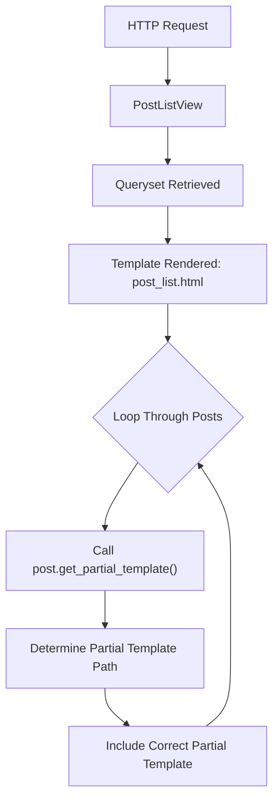
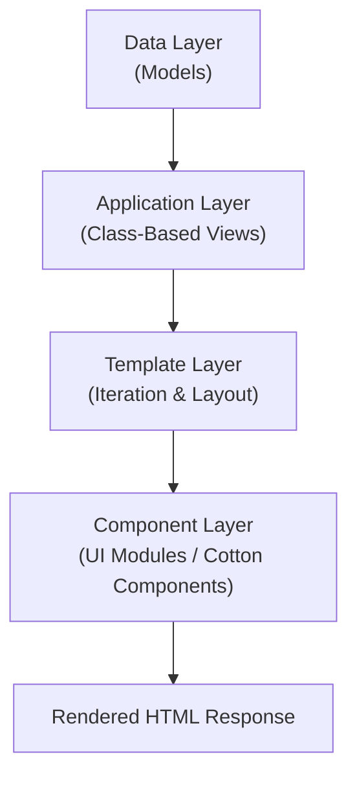

# Templates

## 1. Template Configuration

```python
# settings.py file

TEMPLATES = [
    {
        "BACKEND": "django.template.backends.django.DjangoTemplates",
        "DIRS": [BASE_DIR / "templates"],  # Project-level templates
        "APP_DIRS": True,                  # App-level templates
        "OPTIONS": {
            "context_processors": [
                ...
            ],
        },
    },
]

```

## 2. Scalable Multi-App Project Template Structure

```bash
project_root/
│
├── manage.py
├── config/                     # settings, urls, asgi, wsgi
│
├── templates/                  # GLOBAL templates (project-level)
│   ├── base/
│   │   ├── base.html
│   │   ├── layout.html
│   │   └── admin_base.html
│   │
│   ├── includes/
│   │   ├── navbar.html
│   │   ├── footer.html
│   │   └── messages.html
│   │
│   ├── errors/
│   │   ├── 400.html
│   │   ├── 403.html
│   │   ├── 404.html
│   │   └── 500.html
│   │
│   └── registration/           # Django auth default templates
│       ├── login.html
│       ├── logout.html
│       ├── password_reset_form.html
│       └── ...
│
├── apps/
│   ├── users/
│   │   ├── models.py
│   │   ├── views.py
│   │   ├── urls.py
│   │   └── templates/
│   │       └── users/          # IMPORTANT: namespaced by app name
│   │           ├── profile.html
│   │           ├── dashboard.html
│   │           └── user_list.html
│   │
│   ├── blog/
│   │   ├── models.py
│   │   ├── views.py
│   │   ├── urls.py
│   │   └── templates/
│   │       └── blog/
│   │           ├── post_list.html
│   │           ├── post_detail.html
│   │           └── post_form.html
│   │
│   └── orders/
│       ├── models.py
│       ├── views.py
│       ├── urls.py
│       └── templates/
│           └── orders/
│               ├── order_list.html
│               └── order_detail.html
│
└── static/
```

## 3. Template Syntax
### 1. URL's

```html
<a href="">
    View Post
</a>
```

```html
<a href="">
    {{ category.name }}
</a>
```

```html
<form method="post" action="">
    
</form>
```
### 2. Model Object

```html
<h1>{{ post.title }}</h1>
<p>By {{ post.author.username }} on {{ post.created_at|date:"M d, Y" }}</p>
<p>{{ post.content }}</p>
```

### 3. Forms

!!! danger "CSRF TOKEN"

    CSRF = Cross-Site Request Forgery.

    A CSRF attack occurs when a malicious site tricks a logged-in user into submitting a form to your site without their knowledge.

    Django’s built-in CSRF protection prevents this by requiring a secret token on all POST requests.

    Always include  in POST, PUT, DELETE, or PATCH forms.

    Never trust user input — use form validation.

    Escape user input in templates (auto-escaping is default).

    Use ModelForm when possible to reduce manual errors.

    Validate both server-side and optionally client-side.

    Use AJAX requests with CSRF token in headers.

```html
<form method="post">
    
    
        <div class="form-group">
            <label for="{{ field.id_for_label }}">{{ field.label }}</label>
            {{ field }}
            
                <small class="form-text text-muted">{{ field.help_text }}</small>
            
            
                <div class="error">{{ error }}</div>
            
        </div>
    

    <button type="submit">Submit</button>
</form>
```

!!! tip "Using as_p, as_ul, as_table"

    - `{{ form.as_p }}` → Wraps each field in `<p>`

    - `{{ form.as_ul }}` → Wraps fields in `<li>`

    - `{{ form.as_table }}` → Wraps fields in `<tr>`

- `{{ form.as_p }}`:

```html
<form method="post">
    
    {{ form.as_p }}
    <button type="submit">Send</button>
</form>
```

- `{{ form.as_ul }}`:

```html
<form method="post">
    
    {{ form.as_ul }}
    <button type="submit">Send</button>
</form>
```

- `{{ form.as_table }}`:

```html
<form method="post">
    
    {{ form.as_table }}
    <button type="submit">Send</button>
</form>
```

### 4. Conditionals

- IF/ELSE:

```html

    <p>Welcome, {{ user.username }}!</p>

    <p>Hello, guest! <a href="">Login</a></p>

```

```html

    <span class="badge bg-success">Published</span>

    <span class="badge bg-warning">Draft</span>

```

```html

    <p>You are an adult.</p>

    <p>Access restricted.</p>

```

- IF/ELIF/ELSE:

```html

    <p>Staff panel access granted.</p>

    <p>Regular user.</p>

    <p>Inactive user.</p>

```

- Nested Iteration:

```html

    <ul>
    
        <li>{{ post.title }}</li>
    
    </ul>

    <p>No posts available.</p>

```

- Combining Conditionals With Filters:

```html

    <p>{{ post.content|truncatewords:20 }}...</p>

    <p>{{ post.content }}</p>

```
- Example: Blog Post Card With Conditionals

```html
<div class="post-card">
    <h2>{{ post.title }}</h2>
    <p>By {{ post.author.username }} on {{ post.created_at|date:"M d, Y" }}</p>
    
    
        <span class="badge bg-success">Published</span>
    
        <span class="badge bg-warning">Draft</span>
    

    
        <p>Tags:
        
            {{ tag.name }}, 
        
        </p>
    
</div>
```

!!! tip "Working with Conditionals"

    1. Templates cannot evaluate complex expressions (no arithmetic like a + b > c directly). Precompute in views or model properties.

    2. Keep logic presentation-only — avoid querying the database inside conditionals.

    3. Use  to highlight validation errors for forms.

    4.  works exactly like Python elif.

    5. Avoid overly nested conditionals; precompute flags in view if needed.

### 5. Iteration

- Basic Iteration

```html
<ul>

    <li>{{ post.title }}</li>

</ul>
```

- Empty Iterables

```html
<ul>

    <li>{{ post.title }}</li>

    <li>No posts available.</li>

</ul>
```
- Nested Iteration

```html

    <h3>{{ category.name }}</h3>
    <ul>
    
        <li>{{ post.title }}</li>
    
        <li>No posts in this category.</li>
    
    </ul>

```
- Iterating Over Dictionary Items

```html

    <p>{{ key }} → {{ value }}</p>

```

- Slicing QuerySets

```html

    <p>{{ post.title }}</p>

```

- Reversing

```html

    <p>{{ post.title }}</p>

```

- Complete Example: Blog List With Iteration

```html
<h1>Blog Posts</h1>


<div class="post-card">
    <h2>{{ post.title }}</h2>
    <p>By {{ post.author.username }} on {{ post.created_at|date:"M d, Y" }}</p>

    
        <p>Tags:
        
            {{ tag.name }}, 
        
        </p>
    

    
        <hr>
    
</div>

<p>No blog posts available.</p>

```

- ForeignKey Reverse Relation

```python
class Comment(models.Model):
    post = models.ForeignKey(Post, related_name="comments", on_delete=models.CASCADE)
    content = models.TextField()
```

```html

    <p>{{ comment.content }}</p>

    <p>No comments yet.</p>

```

- ManyToManyField

```html
<p>Tags:

    {{ tag.name }}, 

    None

</p>
```

!!! note "Best Practices"

    1. Always use  to handle empty lists gracefully.

    2. Use forloop metadata for numbering, styling first/last items, or nested loops.

    3. Perform filtering/sorting in views, not in templates.

    4. Keep logic presentation-only — avoid complex calculations in loops.

    5. Use slicing or reversed for display purposes only.

### 6. Blocks & Partials

- The framework’s template inheritance system enables to create a base template that contains the standard structure and the layout for website or app.

- Child templates can be created, that inherit from the base template and override specific blocks of sections as needed. This encourages code reuse and consistency across different templates.

```html
<!-- base.html -->
<!DOCTYPE html>
<html>
  <head>
    <title>Default Title</title>
  </head>
  <body>
    
    
  </body>
</html>
```

```html
<!-- child_template.html -->


My Page Title


  <h1>My Page Content</h1>
  <p>This is the content of my page.</p>

```

- Example: File Structure

```html
templates/
│
├── base.html
├── pages/
│   └── home.html
└── partials/
    ├── navbar.html
    └── footer.html

```

- base.html

```html
<!DOCTYPE html>
<html>
<head>
  <title>Default Title</title>
</head>
<body>

  

  <main>
    
  </main>

  

</body>
</html>
```

- partials/navbar.html

```html
<nav>
  <ul>
    <li><a href="">Home</a></li>
    <li><a href="">About</a></li>
    <li><a href="">Contact</a></li>
  </ul>
</nav>
```

- partials/footer.html

```html
<footer>
  <p>&copy; {{ year }} MySite</p>
</footer>
```

- pages/home.html

```html


Home


  <h1>Welcome</h1>
  <p>This is the homepage.</p>

```
- Passing Context to Partials

```html

```
- `only` prevents leaking the parent context.

- This improves predictability and reduces coupling.

```html

```
- partials/post_card.html

```html
<article class="post">
  <h2>{{ post.title }}</h2>
  <p>{{ post.summary }}</p>
</article>
```
- usage

```html

  

```

### 7. Static Files

- `` — Import Template Tag Libraries. Used to load built-in or custom template tag libraries.

- Loads the static template tag library.

- Required before using ``.

```html



<script src=""></script>
```
 
- Static Config in `settings.py`:

```python

STATIC_URL = '/static'

STATICFILES_DIRS = [os.path.join(BASe_DIR, 'static')]
```

### 8. Template Filters

- Django Template Filter Syntax:

```bash
{{ value|filter_name }}
{{ value|filter_name:argument }}
```
- Quick Summary Table

| Category | Common Filters                       |
| -------- | ------------------------------------ |
| Strings  | lower, upper, slugify, truncatewords |
| Numbers  | add, floatformat                     |
| Lists    | length, first, last, join            |
| Dates    | date, timesince                      |
| Logic    | default, yesno                       |
| HTML     | safe, escape, urlize                 |

#### 1. String Filters

- addslashes

- Escapes quotes with backslashes.
```html
{{ "I'm Django"|addslashes }}
```
- capfirst

- Escapes quotes with backslashes.
```html
{{ "django"|capfirst }}
```

- center

- Centers string in given width.
```html
{{ "hi"|center:10 }}
```

- cut

- Removes all occurences of substring.
```html
{{ "Hello World"|cut:" " }}
```

- escape

- Escapes HTML.
```html
{{ "<b>bold</b>"|escape }}
```

- escapejs

- Escapes for JavaScript strings.
```html
{{ value|escapejs }}
```

- linebreaks

- Converts line breaks into `<p>` and `<br>`.
```html
{{ text|linebreaks }}
```

- linebreaksbr

- Converts line breaks into `<br>` only.
```html
{{ text|linebreaksbr }}
```

- lower

- Lowercase letters.
```html
{{ "DJANGO"|lower }}
```

- upper

- Uppercase letters.
```html
{{ "django"|upper }}
```

- slugify

- Create a slug text.
```html
{{ "Hello World"|slugify }}
```

- title

- Turns text into Title.
```html
{{ "hello world"|title }}
```

- truncatechars
```html
{{ text|truncatechars:20 }}
```

- truncatewords
```html
{{ text|truncatewords:10 }}
```

- scriptags

- Removes HTML tags.
```html
{{ html_content|striptags }}
```

#### 2. Numeric Filters

- add
```html
{{ 5|add:3 }}
```

- floatformat
```html
{{ 3.14159|floatformat:2 }}
```

- filesizeformat
```html
{{ file_size|filesizeformat }}
```

#### 3. List Filters

- dictsort
```html

```

- dictsortreversed
```html

```

- first
```html
{{ my_list|first }}
```

- last
```html
{{ my_list|last }}
```

- join
```html
{{ my_list|join:", " }}
```

- lenght
```html
{{ my_list|length }}
```

- random
```html
{{ my_list|random }}
```

- slice
```html
{{ my_list|slice:":3" }}
```

#### 4. Date & Time Filters

- date
```html
{{ my_date|date:"Y-m-d" }}
```

- time
```html
{{ my_time|time:"H:i" }}
```

- timesince
```html
{{ my_date|timesince }}
```

- timeuntil
```html
{{ future_date|timeuntil }}
```

#### 5. Boolean/Logic Filters

- default
```html
{{ value|default:"N/A" }}
```
- default_if_none
```html
{{ value|default_if_none:"N/A" }}
```

- yesno
```html
{{ value|yesno:"Yes,No,Maybe" }}
```

#### 6. Formatting & HTML Filters

- safe

- Use carefully (XSS risk).
```html
{{ html_content|safe }}
```

- urlencode
```html
{{ value|urlencode }}
```

- urlize

- Converts URLs to clickable links.
```html
{{ text|urlize }}
```

- wordcount
```html
{{ text|wordcount }}
```

- wordwrap
```html
{{ text|wordwrap:30 }}
```

#### 7. JSON & Debug

- json_script
```html
{{ data|json_script:"data-id" }}
```
- pprint
```html
{{ object|pprint }}
```

#### 8. Miscellaneous

- pluralize
```html
{{ count }} item{{ count|pluralize }}
```

- make_list
```html
{{ "abc"|make_list }}
```

- unordered_list
```html
{{ nested_list|unordered_list }}
```
## 4. Tags

- Comment 

```html

    Hidden from output

```

- With

```html

    {{ total }}

```

- Verbatim (Prevents template parsing)

    - It will render `{{ this_will_not_render }}` as is (including double brackets).

```html

{{ this_will_not_render }}

```

- Language

```html

    {{ value }}

```

- Get current language

```html

```

- Get available languages

```html

```

- Block trans

```html

    Hello {{ username }}


```

- Cycle

- Used for: 

    UI presentation patterns

    Alternating CSS classes

    Repeated decorative values

- Named Cycle (Reusable Inside Loop)

```html

    
    <tr class="{{ rowclass }}">
        <td>{{ product.name }}</td>
    </tr>

```

- Using cycle Multiple Times Per Row

```html

    
    <div class="box {{ color }}">
        {{ item }}
        <span class="{{ color }}">Highlight</span>
    </div>

```

- Silent Cycle (Prevent Immediate Output)

```html

    
    <div class="{{ rowclass }}">
        {{ item }}
    </div>

```

- Resetting a Named Cycle

```html

    <h2>{{ category.name }}</h2>

    
        
        <div class="{{ rowclass }}">
            {{ product.name }}
        </div>
    

    


```

## 5. Dynamic Partials

### Step 1 — Create the Model

```python
from django.db import models

class Post(models.Model):
    title = models.CharField(max_length=200)
    content = models.TextField()
    featured = models.BooleanField(default=False)

    def get_partial_template(self):
        """
        Return the template path for rendering this object.
        Keeps UI decision close to the model.
        """
        if self.featured:
            return "blog/partials/_featured_post.html"
        return "blog/partials/_standard_post.html"

    def __str__(self):
        return self.title
```

- Rendering strategy is tied to model state.

- Template logic remains minimal.

- View stays clean.

### Step 2 — Create the CBV

```python
from django.views.generic import ListView
from .models import Post

class PostListView(ListView):
    model = Post
    template_name = "blog/post_list.html"
    context_object_name = "posts"
```

- No branching logic inside the view.

- The model handles template resolution.

### Step 3 — Create Partial Templates

```bash
templates/
    blog/
        post_list.html
        partials/
            _standard_post.html
            _featured_post.html
```

```html
<!-- _standard_post.html -->

<article class="post">
    <h2>{{ post.title }}</h2>
    <p>{{ post.content|truncatewords:30 }}</p>
</article>

```

```html
<!-- _featured_post.html -->

<article class="post featured">
    <h2>⭐ {{ post.title }}</h2>
    <p>{{ post.content }}</p>
</article>
```
- Each partial has a single responsibility.

### Step 4 — Use Dynamic Include in Template

```html
<!-- post_list.html -->




<h1>Posts</h1>


    

    <p>No posts available.</p>



```
- `post.get_partial_template` determines which partial to use.

- `only` prevents context leakage.

- Template contains no branching logic.

### Step 5 — Add URL Configuration

```python
from django.urls import path
from .views import PostListView

urlpatterns = [
    path("posts/", PostListView.as_view(), name="post_list"),
]
```

### Alternative: Compute in get_context_data()

- Model:

```python
class PostListView(ListView):
    model = Post
    template_name = "blog/post_list.html"

    def get_context_data(self, **kwargs):
        context = super().get_context_data(**kwargs)
        posts = context["object_list"]

        for post in posts:
            post.partial_template = (
                "blog/partials/_featured_post.html"
                if post.featured
                else "blog/partials/_standard_post.html"
            )

        return context
```

- Template:
```html

    

```
### When to Choose Which Approach?

| Approach             | When to Use                               |
| -------------------- | ----------------------------------------- |
| Model method         | Rendering strategy depends on model state |
| `get_context_data()` | Rendering depends on request/user context |
| Service layer        | Rendering logic is complex or cross-model |

### Best Practices Summary Table

| Category             | Best Practice                                            | Why                             |
| -------------------- | -------------------------------------------------------- | ------------------------------- |
| Template Logic       | Keep branching out of templates                          | Improves readability            |
| Dynamic Includes     | Compute template name in Python                          | Clean separation of concerns    |
| Context Isolation    | Use `only` in ``                            | Prevent context leakage         |
| File Structure       | Store partials in `app/partials/`                        | Namespacing + clarity           |
| Partial Naming       | Prefix with `_`                                          | Signals non-standalone template |
| Model Responsibility | Use model method when rendering depends on model state   | Encapsulation                   |
| View Responsibility  | Use `get_context_data()` for request-dependent decisions | Proper layering                 |
| Avoid                | Heavy logic in templates                                 | Violates MVC separation         |
| Reusability          | Keep partials small and single-purpose                   | Scalable UI composition         |

!!! tip "Architectural Pattern"

    Well-structured dynamic rendering follows:

    Model → defines rendering strategy

    View → retrieves data

    Template → delegates to partial

    Partial → renders UI

## 6. Django-Cotton Package

### 1. Django-Cotton Setup



#### 1. Install Cotton

```bash
pip install django-cotton
```
#### 2. Register in INSTALLED_APPS

```python
INSTALLED_APPS = [
    ...
    "cotton",
]
```
#### 3. Project Structure Example

```bash
templates/
    base.html
    blog/
        post_list.html
    components/
        post-card.html
        featured-post-card.html
```
#### 4. Add `` to HTML

```html

```

### 2. Cotton Example

#### 1. Model

```python
from django.db import models

class Post(models.Model):
    title = models.CharField(max_length=200)
    content = models.TextField()
    featured = models.BooleanField(default=False)

    def get_component_name(self):
        """
        Decide which component should render this object.
        """
        return "featured-post-card" if self.featured else "post-card"

    def __str__(self):
        return self.title
```

#### 2. CBV (Class Based View)

```python
from django.views.generic import ListView
from .models import Post

class PostListView(ListView):
    model = Post
    template_name = "blog/post_list.html"
    context_object_name = "posts"
```

#### 3. Create Component

- templates/components/post-card.html

```html
<article class="post-card">
    <h2>{{ post.title }}</h2>
    <p>{{ post.content|truncatewords:20 }}</p>
</article>
```

- templates/components/featured-post-card.html

```html
<article class="post-card featured">
    <h2>⭐ {{ post.title }}</h2>
    <p>{{ post.content }}</p>
</article>
```

#### 4. Use Cotton in Template

```html





<h1>Posts</h1>


    

    <p>No posts available.</p>



```

- No ``

- No branching

- Fully component-driven rendering

## 7. Example & Best Practices

- App-Level Templates (Namespaced):

```bash
project/
│
├── project/
│   ├── settings.py
│   └── urls.py
│
├── apps/
│   ├── blog/
│   │   ├── templates/
│   │   │   └── blog/
│   │   │       ├── base_blog.html
│   │   │       ├── post_list.html
│   │   │       ├── post_detail.html
│   │   │       └── partials/
│   │   │           └── post_card.html
│   │   └── views.py
│   │
│   └── accounts/
│       ├── templates/
│       │   └── accounts/
│       │       ├── login.html
│       │       └── register.html
│
└── templates/
    ├── base.html
    ├── partials/
    │   ├── navbar.html
    │   ├── footer.html
    │   └── messages.html
    └── includes/

```

- Typical `base.html`:

```html 


<!DOCTYPE html>
<html lang="en">
<head>
    <meta charset="UTF-8">
    <meta name="viewport" content="width=device-width, initial-scale=1.0">

    <title>MySite</title>

    <link rel="stylesheet" href="">
    
</head>
<body>

    

    

    <main class="container">
        
    </main>

    

    <script src=""></script>
    

</body>
</html>
```

- Django Templates Best Practices:

| Area               | Best Practice                       | Description                                                                                 |
| ------------------ | ----------------------------------- | ------------------------------------------------------------------------------------------- |
| **File Structure** | Use app namespacing                 | Place templates inside `app_name/templates/app_name/` to avoid naming conflicts             |
|                    | Separate global templates           | Keep shared templates (e.g., `base.html`, global partials) in a root `templates/` directory |
| **Naming**         | Use explicit, role-based names      | Example: `post_list.html`, `post_detail.html`, `post_form.html`                             |
|                    | Use `_prefix` for partials          | Example: `_navbar.html`, `_form_field.html` to signal non-standalone templates              |
| **Base Template**  | Keep it structural only             | Define layout, static files, and layout structure — avoid business logic                    |
|                    | Provide extension blocks            | Define ``, ``, ``, etc.             |
| **Partials**       | Keep them small and reusable        | Each partial should serve one UI responsibility                                             |
|                    | Store inside `partials/`            | Organize reusable fragments in a dedicated folder                                           |
|                    | Use `with` and `only` appropriately | Pass controlled context using `` when needed         |


- Django Templates — Responsibilities & Boundaries:

| Category               | Allowed / Expected                                            | Not Allowed                  | Where It Should Go Instead   |                 |                                                         |                        |
| ---------------------- | ------------------------------------------------------------- | ---------------------------- | ---------------------------- | --------------- | ------------------------------------------------------- | ---------------------- |
| **Data Handling**      | Render context data passed from the view                      | Fetch data from the database | View or Model                |                 |                                                         |                        |
| **UI Rendering**       | Display HTML structure and layout                             | Generate business rules      | View or Model                |                 |                                                         |                        |
| **Logic Level**        | Handle light presentation logic (`if`, `for`, simple filters) | Heavy conditional logic      | View                         |                 |                                                         |                        |
| **Computation**        | Minor formatting (`                                           | date`, `                     | length`, `                   | truncatewords`) | Business calculations (pricing, discounts, permissions) | Model or Service Layer |
| **Database Access**    | None                                                          | ORM queries inside templates | View                         |                 |                                                         |                        |
| **Complex Formatting** | Basic formatting using filters                                | Complex transformations      | Custom template tag / filter |                 |                                                         |                        |
| **Reusability**        | Use `` and ``                       | Duplicate layout code        | Base template / partials     |                 |                                                         |                        |

- Rule of thumb:

| If the logic becomes…     | Move it to…                 |
| ------------------------- | --------------------------- |
| Data retrieval logic      | View                        |
| Business rules            | Model                       |
| Reusable formatting logic | Custom template tag         |
| Complex UI transformation | Custom template tag or View |