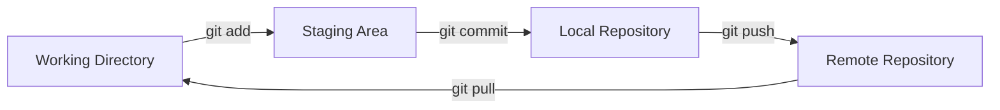
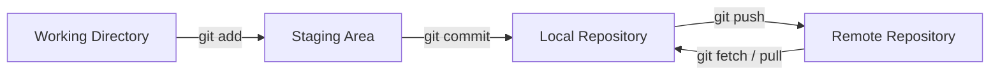

# Git

## Overview

Git is a **distributed version control system (VCS)** used to track changes to files, manage branches, and collaborate with other developers.

!!! info "What does distributed mean?"
    Git is **distributed**, meaning each developer typically has a complete copy of the repository and its history on their local machine.

- Git allows developers to:

    - Track changes to files over time.
    - Create and manage different versions of a project.
    - Work on multiple features using branches.
    - Collaborate with other developers.
    - Revert changes when something goes wrong.
    - Merge work from different developers.
    - Maintain a complete history of a project.

---

## How Git Is Used

A typical Git workflow moves changes through several stages:

---

## Git Jargon

| Term                     | Meaning                                                                                 |
| ------------------------ | --------------------------------------------------------------------------------------- |
| **Repository (repo)**    | A Git-managed project containing files and their complete version history.              |
| **Working directory**    | The checked-out files on your computer that you can edit.                               |
| **Staging area (index)** | The changes selected for inclusion in the next commit.                                  |
| **Commit**               | A recorded snapshot of staged changes.                                                  |
| **Branch**               | A movable pointer to a line of development.                                             |
| **HEAD**                 | A reference to the currently checked-out commit, usually the tip of the current branch. |
| **Main branch**          | The primary branch of a repository, commonly named `main`.                              |
| **Remote**               | A reference to another Git repository, usually hosted on a server.                      |
| **Origin**               | The conventional name for the remote repository created when cloning.                   |
| **Upstream**             | The remote branch that a local branch is configured to track.                           |
| **Clone**                | A local copy of a remote repository, including its history.                             |
| **Fetch**                | Downloads information from a remote without integrating it into the current branch.     |
| **Pull**                 | Fetches changes from a remote and integrates them into the current branch.              |
| **Push**                 | Uploads local commits to a remote repository.                                           |
| **Merge**                | Combines the histories of two branches.                                                 |
| **Merge commit**         | A commit created when Git merges two diverging branches.                                |
| **Fast-forward**         | A merge where the target branch moves forward without creating a merge commit.          |
| **Rebase**               | Replays commits onto a different base commit, creating new commit objects.              |
| **Conflict**             | A situation where Git cannot automatically combine changes.                             |
| **Tag**                  | A named reference to a specific commit, commonly used to mark releases.                 |
| **Stash**                | Temporary storage for uncommitted changes.                                              |
| **Working tree**         | Another term for the checked-out files in the working directory.                        |
| **Tracked file**         | A file that Git monitors for changes.                                                   |
| **Untracked file**       | A file that Git is not yet monitoring.                                                  |
| **Index**                | Git's internal representation of the staging area.                                      |
| **SHA / commit hash**    | An identifier used to reference a Git object, such as a commit.                         |
| **Repository history**   | The sequence of commits recording how a project has changed over time.                  |

---

## Basic Workflow

A typical Git workflow is:

The three main local areas are:

| Area              | Description                          |
| ----------------- | ------------------------------------ |
| Working directory | Files currently being edited         |
| Staging area      | Changes selected for the next commit |
| Repository        | Committed project history            |

!!! tip

    Think of `git add` as preparing changes and `git commit` as recording those prepared changes in Git history.

---

## Topics

* [Installation](installation.md)
* [Configuration](configuration.md)
* [Common Commands](commands.md)
* [Staging & Commits](staging-commits.md)
* [Branching](branching.md)
* [Merging](merging.md)
* [Remote Repositories](remotes.md)
* [Tags](tags.md)
* [Undoing Changes](undoing-changes.md)
* [Stash](stash.md)
* [History](history.md)
* [Diffs](diffs.md)
* [Workflows](workflows.md)