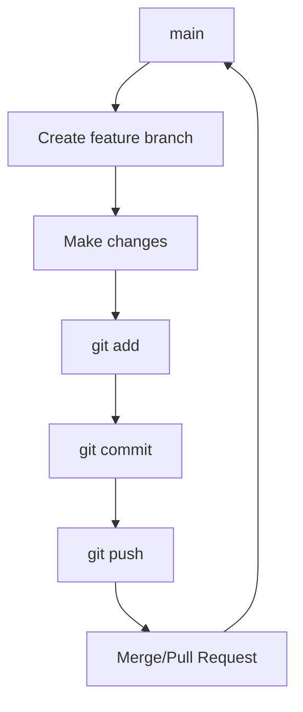

# Git Workflows

## Basic Feature Workflow

Start from the latest `main`:

```bash
git switch main
git pull
```

Create a feature branch:

```bash
git switch -c feature/my-feature
```

Make changes and stage them:

```bash
git add .
```

Commit:

```bash
git commit -m "Add my feature"
```

Push the branch:

```bash
git push -u origin feature/my-feature
```

Create a merge/pull request through your Git hosting platform.

## Typical Workflow



## Keep a Feature Branch Updated

Update local `main`:

```bash
git switch main
git pull
```

Return to the feature branch:

```bash
git switch feature/my-feature
```

Merge the updated `main`:

```bash
git merge main
```

Alternatively, rebase:

```bash
git rebase main
```

!!! warning
    Rebasing rewrites commit history. Avoid rebasing commits that have already been pushed and are being used by other developers unless your team workflow explicitly allows it.


## Conventional Commit Messages

A common convention is:

```text
type(scope): description
```

Examples:

```text
feat(api): add authentication endpoint
fix(auth): handle expired tokens
docs(git): add branching guide
refactor(cli): simplify argument parsing
test(api): add integration tests
chore(deps): update dependencies
```
