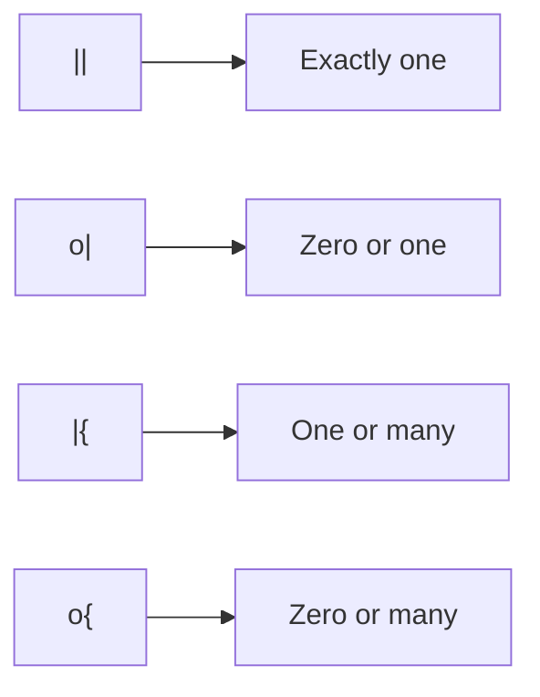
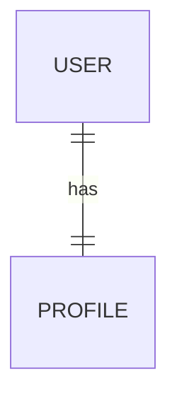
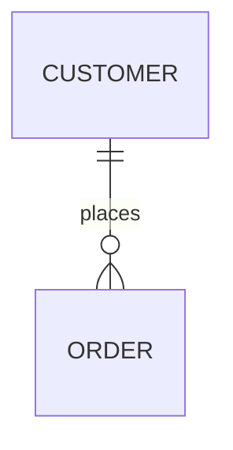
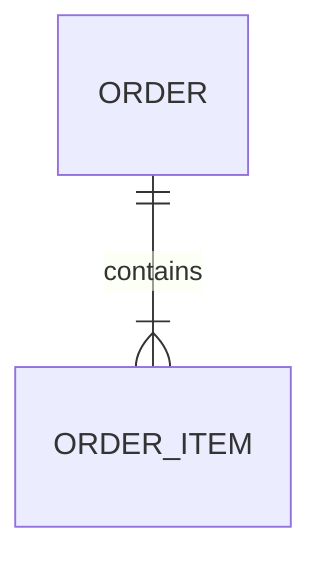
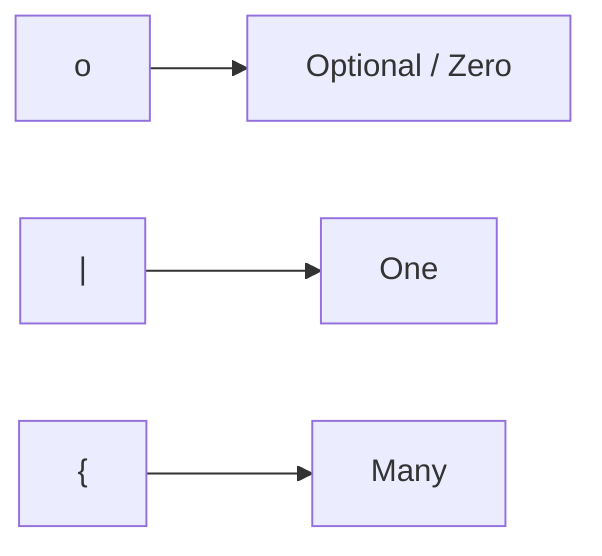
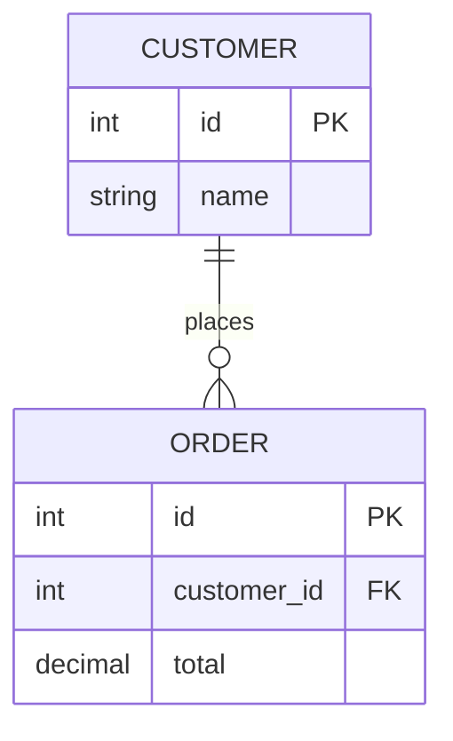
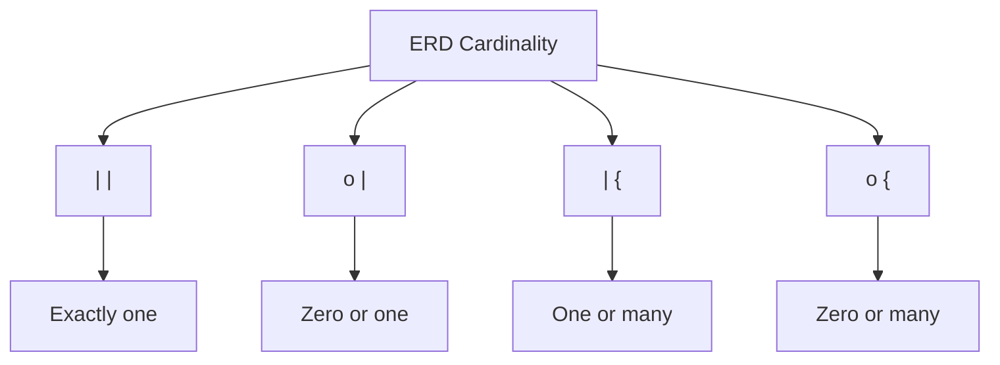
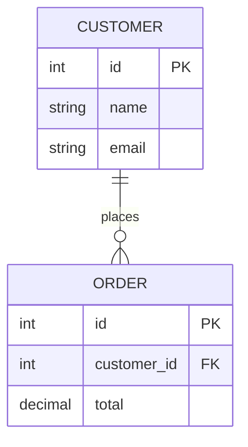

# ERD Symbols & Cardinality

Entity Relationship Diagrams (ERDs) use symbols to describe **how tables are related** and **how many rows can participate in a relationship**.

---

## ERD Cardinality Symbols

| Symbol | Meaning      | Description           |
| ------ | ------------ | --------------------- |
| `\|\|` | Exactly one  | One and only one      |
| `o\|`  | Zero or one  | Optional, at most one |
| `\|{`  | One or many  | At least one          |
| `o{`   | Zero or many | Optional, any number  |
| `--`   | Relationship | Connects two entities |

### Visual Summary



---

## Common Relationship Types

### One-to-One — 1:1

```text
|| ─── ||
```

One record is related to exactly one record.



**Example:**

```text
USER  1 ───────── 1  PROFILE
```

Typical implementation:

```sql
user_id INTEGER UNIQUE
```

---

### One-to-Many — 1:N

```text
|| ─── o{
```

One record can be related to zero or many records.



**Example:**

```text
CUSTOMER  1 ───────── N  ORDER
```

A customer can have zero, one, or many orders.

The foreign key normally lives on the **many side**:

```text
customers
    id
     ▲
     │
orders
    customer_id FK
```

---

### One-to-Many — Required

```text
|| ─── |{
```

One record must be related to one or many records.



**Example:**

```text
ORDER  1 ───────── 1..N  ORDER_ITEM
```

An order must contain at least one order item.

---

### Zero-or-One — 0:1

```text
o| ─── ||
```

A record may or may not have a related record.


**Example:**

```text
USER  1 ───────── 0..1  PROFILE
```

A user can have zero or one profile.

---

### Many-to-Many — N:M

A many-to-many relationship is normally implemented using a **junction table**.


Conceptually:

```text
STUDENT  N ─────── M  COURSE
             │
             │
       ENROLLMENT
```

The database actually implements it as:

```text
STUDENT  1 ─── N  ENROLLMENT  N ─── 1  COURSE
```

---

# Full Cardinality Reference

| Relationship     | Mermaid      | Meaning                     |
| ---------------- | ------------ | --------------------------- |
| **1:1**          | `\|\|--\|\|` | Exactly one to exactly one  |
| **0:1**          | `\|\|--o\|`  | One to zero or one          |
| **1:N**          | `\|\|--\|{`  | One to one or many          |
| **1:N optional** | `\|\|--o{`   | One to zero or many         |
| **N:1**          | `o{--\|\|`   | Zero or many to exactly one |
| **N:M**          | `o{--o{`     | Many-to-many conceptually   |
| **N:M required** | `\|{--\|{`   | One or many to one or many  |

---

# How to Read Crow's Foot Notation

The easiest way to remember the symbols:

```text
o   = zero / optional

|   = one

{   = many
```

Therefore:

```text
o|  = zero or one
|{  = one or many
o{  = zero or many
||  = exactly one
```

Think of the **circle** as "optional" and the **crow's foot** as "many".



---

# Example: Customer and Orders



Read the relationship from both sides:

```text
CUSTOMER || ───────── o{ ORDER
```

### From the CUSTOMER perspective

```text
1 customer
    ↓
0 or many orders
```

### From the ORDER perspective

```text
1 order
    ↓
exactly 1 customer
```

Therefore:

```text
CUSTOMER  1 ───────── 0..N  ORDER
```

---

# ERD Symbol Cheat Sheet



| Symbol | Remember It As      |                 |                 |
| ------ | ------------------- | --------------- | --------------- |
| `o`    | **Optional / zero** |                 |                 |
| `      | `                   | **One**         |                 |
| `{`    | **Many**            |                 |                 |
| `o     | `                   | **Zero or one** |                 |
| `      | {`                  | **One or many** |                 |
| `o{`   | **Zero or many**    |                 |                 |
| `      |                     | `               | **Exactly one** |

> **Memory trick:**
> `o` = **optional**, `|` = **one**, `{` = **many**.

---

# Primary Key & Foreign Key Symbols

ERD diagrams also commonly identify keys inside entities.



| ERD Label | Meaning                                      |
| --------- | -------------------------------------------- |
| `PK`      | Primary Key                                  |
| `FK`      | Foreign Key                                  |
| `PK, FK`  | Column is both a Primary Key and Foreign Key |

For example:

```text
CUSTOMER
┌──────────────────┐
│ id        PK     │
│ name             │
│ email            │
└──────────────────┘
          │
          │ 1:N
          ▼
┌──────────────────┐
│ ORDER            │
│ id        PK     │
│ customer_id FK   │
│ total            │
└──────────────────┘
```

---

## Quick Reference

```text
┌────────┬──────────────────────┐
│ Symbol │ Meaning              │
├────────┼──────────────────────┤
│   o    │ Zero / Optional      │
│   |    │ One                  │
│   {    │ Many                 │
│  o|    │ Zero or One          │
│  |{    │ One or Many          │
│  o{    │ Zero or Many         │
│  ||    │ Exactly One          │
│  PK    │ Primary Key          │
│  FK    │ Foreign Key          │
└────────┴──────────────────────┘
```
