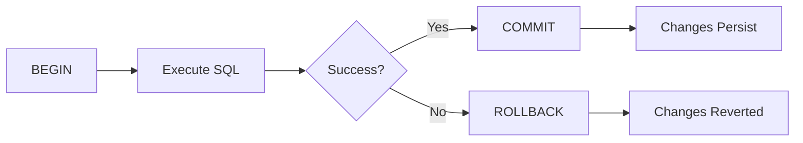

# Indexes, Constraints & Transactions

## Indexes

An **index** is a data structure that helps the database find rows faster.

Without an index, the database may need to scan the entire table:

```text
Table → scan every row → find matching rows
```

With an index:

```text
Query → Index → matching rows
```

### Creating an Index

```sql
CREATE INDEX idx_customers_email
ON customers(email);
```

Queries filtering by `email` can potentially use this index:

```sql
SELECT *
FROM customers
WHERE email = 'user@example.com';
```

### Unique Index

```sql
CREATE UNIQUE INDEX idx_users_email
ON users(email);
```

This prevents duplicate values.

!!! danger "Important"

    Indexes improve **read performance**, but they also:

    * Consume storage.
    * Make `INSERT`, `UPDATE`, and `DELETE` slightly more expensive.
    * Should be created on columns that are frequently searched, joined, or sorted.

    > **Rule of thumb:** Index columns used frequently in `WHERE`, `JOIN`, and sometimes `ORDER BY` clauses — but don't index everything.

---

## Constraints

**Constraints** enforce rules on data stored in a table.

| Constraint    | Purpose                               | Example                                |
| ------------- | ------------------------------------- | -------------------------------------- |
| `PRIMARY KEY` | Uniquely identifies each row          | `id INTEGER PRIMARY KEY`               |
| `FOREIGN KEY` | Enforces relationships between tables | `customer_id REFERENCES customers(id)` |
| `UNIQUE`      | Prevents duplicate values             | `email VARCHAR(255) UNIQUE`            |
| `NOT NULL`    | Requires a value                      | `name VARCHAR(100) NOT NULL`           |
| `CHECK`       | Requires a condition to be true       | `age INTEGER CHECK (age >= 18)`        |
| `DEFAULT`     | Provides a default value              | `active BOOLEAN DEFAULT TRUE`          |

- Example

```sql
CREATE TABLE users (
    id INTEGER PRIMARY KEY,
    email VARCHAR(255) UNIQUE NOT NULL,
    age INTEGER CHECK (age >= 18),
    active BOOLEAN DEFAULT TRUE
);
```

Constraints protect **data integrity** by preventing invalid data from entering the database.

---

## Transactions

A **transaction** is a group of SQL operations that are treated as a single unit of work.

Either:

```text
All operations succeed
        ↓
      COMMIT
```

or:

```text
Something fails
        ↓
      ROLLBACK
```

- Example

Transferring money between two accounts:

```sql
BEGIN;

UPDATE accounts
SET balance = balance - 100
WHERE id = 1;

UPDATE accounts
SET balance = balance + 100
WHERE id = 2;

COMMIT;
```

If something goes wrong:

```sql
ROLLBACK;
```

This prevents the database from being left in an inconsistent state.

---

## ACID

Transactions are commonly described using **ACID**:

| Property        | Meaning                                                            |
| --------------- | ------------------------------------------------------------------ |
| **Atomicity**   | All operations succeed or none do                                  |
| **Consistency** | Data remains valid according to database rules                     |
| **Isolation**   | Concurrent transactions don't improperly interfere with each other |
| **Durability**  | Committed changes survive failures                                 |

### Transaction Flow



---

## Quick Reference

```text
INDEX
  → Improves query performance

CONSTRAINT
  → Protects data integrity

TRANSACTION
  → Groups operations into one unit of work
```

A useful way to think about them:

```text
Indexes      → How quickly can I find the data?
Constraints  → Is the data valid?
Transactions → What happens if multiple operations must succeed together?
```