# Entity Relationships

## Relational Database Concepts

A typical relational database consists of:

```text
Database
│
├── Tables
│   ├── users
│   ├── products
│   └── orders
│
├── Relationships
│   ├── Primary keys
│   └── Foreign keys
│
├── Indexes
│
├── Constraints
│
└── Transactions
```

Relationships allow tables to work together rather than storing everything in one large table.

- For example:
```text
users
  │
  │ user_id
  ▼
orders
  │
  │ product_id
  ▼
products
```
---

## SQL Relationships

SQL relationships describe how rows in one table relate to rows in another table.

The three fundamental relationship types are:

* **One-to-One (1:1)**
* **One-to-Many (1:N)**
* **Many-to-Many (M:N)**

---

## 1. One-to-One Relationship

A **one-to-one** relationship means that one row in a table is related to **at most one row** in another table.

A user has one profile, and each profile belongs to one user.

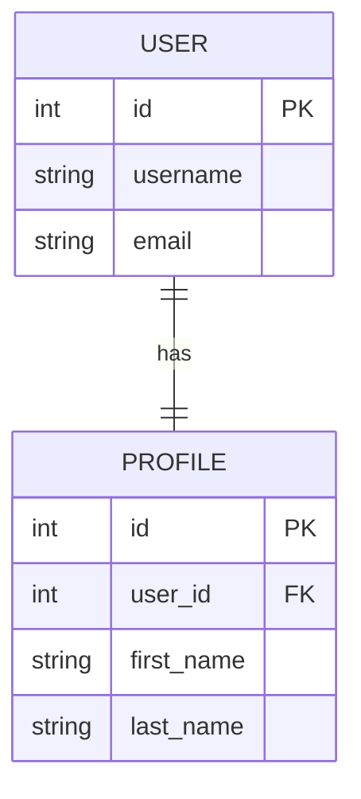

```text
USER
-----
id
username
email

PROFILE
-------
id
user_id
first_name
last_name
```

The `PROFILE.user_id` column references `USER.id`.

```sql
CREATE TABLE users (
    id INTEGER PRIMARY KEY,
    username VARCHAR(100),
    email VARCHAR(255)
);

CREATE TABLE profiles (
    id INTEGER PRIMARY KEY,
    user_id INTEGER UNIQUE,
    first_name VARCHAR(100),
    last_name VARCHAR(100),

    FOREIGN KEY (user_id)
        REFERENCES users(id)
);
```

The `UNIQUE` constraint on `user_id` prevents multiple profiles from belonging to the same user.

---

## 2. One-to-Many Relationship

A **one-to-many** relationship means that one row in a table can be related to **many rows** in another table.

This is one of the most common relationships in relational databases.

One customer can have many orders.

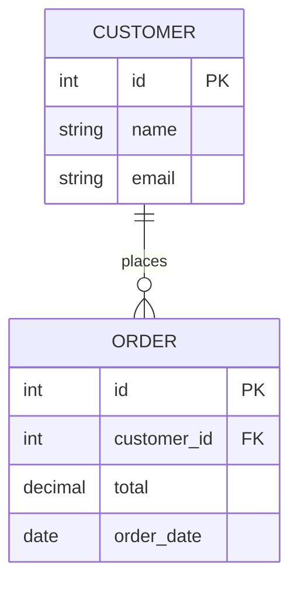

The relationship can be understood as:

```text
CUSTOMER
   │
   ├── ORDER
   ├── ORDER
   ├── ORDER
   └── ORDER
```

The foreign key is stored on the **many side**:

```text
CUSTOMER.id
     ▲
     │
ORDER.customer_id
```

- SQL

```sql
CREATE TABLE customers (
    id INTEGER PRIMARY KEY,
    name VARCHAR(100),
    email VARCHAR(255)
);

CREATE TABLE orders (
    id INTEGER PRIMARY KEY,
    customer_id INTEGER,
    total DECIMAL(10, 2),
    order_date DATE,

    FOREIGN KEY (customer_id)
        REFERENCES customers(id)
);
```

- Querying the relationship

```sql
SELECT
    customers.name,
    orders.id,
    orders.total
FROM customers
JOIN orders
    ON customers.id = orders.customer_id;
```

---

## 3. Many-to-Many Relationship

A **many-to-many** relationship means that:

* One row in table A can relate to many rows in table B.
* One row in table B can relate to many rows in table A.

Relational databases normally implement this using a **junction table** (also called an associative or bridge table).

Students can enrol in many courses, and each course can have many students.

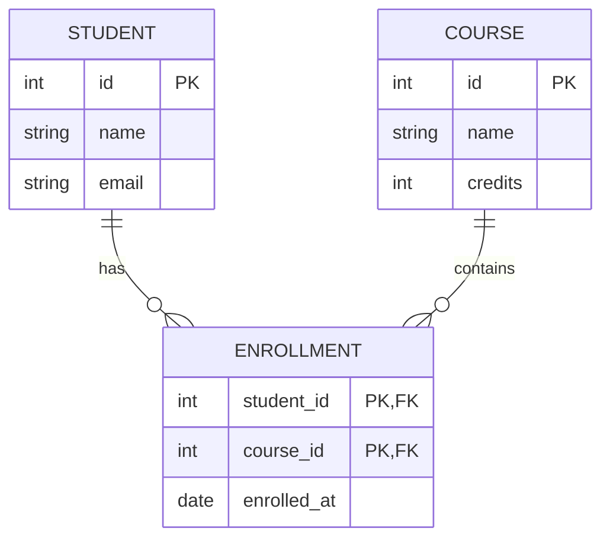

The relationship becomes:

```text
STUDENT
   │
   ├── ENROLLMENT ─── COURSE
   ├── ENROLLMENT ─── COURSE
   └── ENROLLMENT ─── COURSE
```

The `ENROLLMENT` table breaks the many-to-many relationship into two one-to-many relationships.

```text
STUDENT  1 ─── N  ENROLLMENT  N ─── 1  COURSE
```

- SQL

```sql
CREATE TABLE students (
    id INTEGER PRIMARY KEY,
    name VARCHAR(100),
    email VARCHAR(255)
);

CREATE TABLE courses (
    id INTEGER PRIMARY KEY,
    name VARCHAR(100),
    credits INTEGER
);

CREATE TABLE enrollments (
    student_id INTEGER,
    course_id INTEGER,
    enrolled_at DATE,

    PRIMARY KEY (student_id, course_id),

    FOREIGN KEY (student_id)
        REFERENCES students(id),

    FOREIGN KEY (course_id)
        REFERENCES courses(id)
);
```

The composite primary key prevents the same student from being enrolled in the same course more than once.

---

## 4. Foreign Key Relationship

A **foreign key** connects a column in one table to a primary key or unique key in another table.

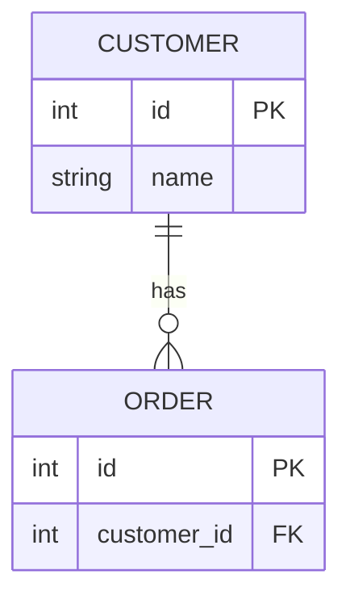

The relationship is:

```text
CUSTOMER
    id  ←──────── customer_id
                     │
                   ORDER
```

- SQL

```sql
FOREIGN KEY (customer_id)
    REFERENCES customers(id)
```

The foreign key maintains **referential integrity**.

---

## 5. Self-Referencing Relationship

A table can also reference **itself**.

This is useful for hierarchical data such as employees and managers.

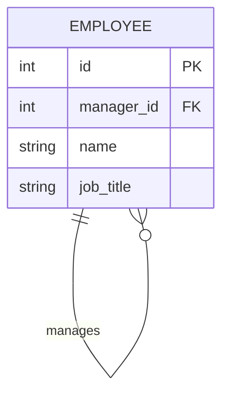

Example:

```text
CEO
├── Engineering Manager
│   ├── Developer
│   └── Developer
└── Sales Manager
    ├── Salesperson
    └── Salesperson
```

The table contains a foreign key pointing back to itself:

```sql
CREATE TABLE employees (
    id INTEGER PRIMARY KEY,
    manager_id INTEGER,
    name VARCHAR(100),
    job_title VARCHAR(100),

    FOREIGN KEY (manager_id)
        REFERENCES employees(id)
);
```

The CEO can have a `NULL` `manager_id` because they do not report to another employee.

---

## 6. Multiple Relationships

A table can participate in several relationships.

For example:

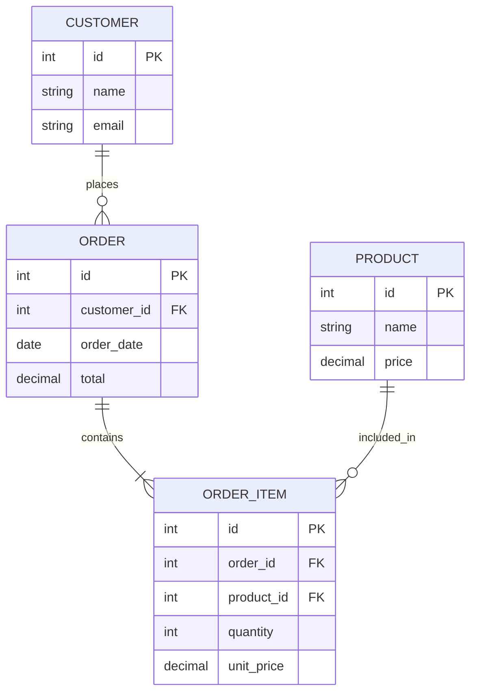

This represents a typical e-commerce database:

```text
CUSTOMER
   │
   │ 1:N
   ▼
 ORDER
   │
   │ 1:N
   ▼
ORDER_ITEM
   ▲
   │ N:1
   │
PRODUCT
```

A customer can have many orders.

An order can contain many order items.

A product can appear in many order items.

---

## 7. Relationship Cardinality

Mermaid ER diagrams use symbols to represent **cardinality**.

| Mermaid | Meaning      |
| ------- | ------------ |
| `\|\|`  | Exactly one  |
| `o\|`   | Zero or one  |
| `o{`    | Zero or many |
| `\|{`   | One or many  |

- Common combinations

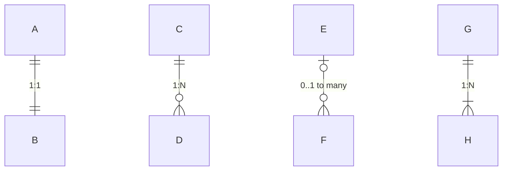

The symbols can be read from left to right.

For example:

```text
CUSTOMER ||--o{ ORDER
```

means:

```text
One CUSTOMER
     │
     └──── zero or many ORDERS
```

---

## 8. Optional vs Required Relationships

Cardinality also tells us whether a relationship is optional.

### Optional

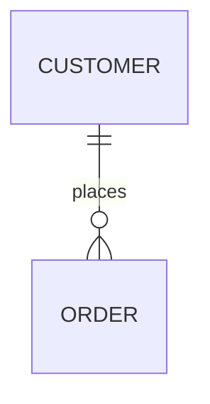

A customer can exist without having any orders.

```text
CUSTOMER
   │
   ├── ORDER
   ├── ORDER
   └── no orders is also valid
```

### Required

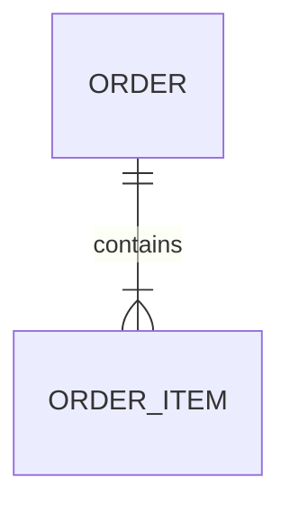

An order must contain **one or more** order items.

```text
ORDER
   │
   ├── ORDER_ITEM
   ├── ORDER_ITEM
   └── ...
```

---

## 9. Relationships and JOINs

SQL relationships are commonly used with `JOIN`.

Consider:

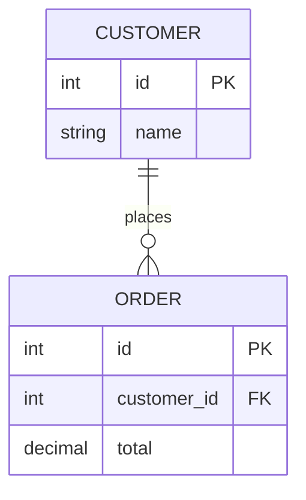

The foreign key relationship is:

```text
customers.id
     ▲
     │
orders.customer_id
```

The corresponding SQL `JOIN` is:

```sql
SELECT
    customers.name,
    orders.total
FROM customers
JOIN orders
    ON customers.id = orders.customer_id;
```

The `ON` condition tells SQL **how the tables are related**.

---

## 10. Relationship Summary

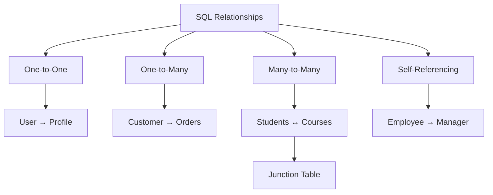

| Relationship       | Example            | Typical Implementation             |
| ------------------ | ------------------ | ---------------------------------- |
| **1:1**            | User → Profile     | Foreign key + `UNIQUE`             |
| **1:N**            | Customer → Orders  | Foreign key on the many side       |
| **N:M**            | Students ↔ Courses | Junction table                     |
| **Self-reference** | Employee → Manager | Foreign key referencing same table |

---

## Key Rule

For relational database design, remember:

```text
1:1  →  Foreign key + UNIQUE
1:N  →  Foreign key on the "many" side
N:M  →  Junction / bridge table
```

The foreign key is the mechanism that connects related rows, while **cardinality** describes how many rows can participate in that relationship.